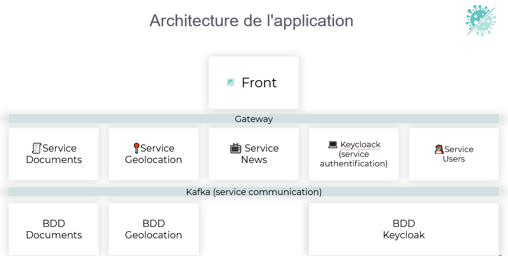

# Code structure
- **Code** :
	- *config*: All configurations that link the microservice and the user management services (*Keycloak*) and the messages recorded on *Kafka*.
	- *controllers*: The structure of the application is **MVC** (Model, View, Controller). In a microservice environment, the controller allows the creation of each specific path and link this path to a specific functionality.
	- *dtos* : DTOs or Data Transfer Objects are templates that allow to retrieve information from the *body* of HTTP requests that are not exactly similar to a template (*see next part*).
	- *models*: Models are important elements in the **MVC** structure. Indeed, they allow to link a Java class to a table of the database allowing to manipulate similar objects (attributes).
	- *repositories* : The *repositories* are interfaces allowing to automatically perform (thanks to the JPA dependency) functions that perform SQL queries (findById, findByUsername etc.) on the database linked to the microservice.
	- *services*: Services are used to extend the business logic and take it out of the controllers so that it can be reused.
	- *tools*: The classes put in this package are used to implement specific functions that have little to do with the business logic.

- **Tests** : 
	- *controller tests*: Controller tests are integration tests that test the proper routing and operation of requests sent from the front end.
	- *repository tests*: The repository tests are integration tests that allow you to test the correct operation of actions performed on the database (access, deletion and modification requests).

## Example of code structure on the "Geolocation" microservice
```
.
└── coviwad_geolocation/
    ├── src/
    │   ├── main/
    │   │   ├── java/
    │   │   │   └── fr.polytech.mtp.coviwad_geolocation/
    │   │   │       ├── config/
    │   │   │       │   ├── KafkaConfiguration.java
    │   │   │       │   └── KeycloakSecurityConfig.java
    │   │   │       ├── controllers/
    │   │   │       │   └── GeolocationController.java
    │   │   │       ├── dtos/
    │   │   │       │   └── PositiveTestDTO.java
    │   │   │       ├── models/
    │   │   │       │   └── Geolocation.java
    │   │   │       ├── repositories/
    │   │   │       │   └── GeolocationRepository.java
    │   │   │       ├── services/
    │   │   │       │   ├── EmailService.java
    │   │   │       │   └── GeolocationKafkaService.java
    │   │   │       ├── utils/
    │   │   │       │   └── GeolocationUtils.java
    │   │   │       └── CoviwadGeolocationApplication.java
    │   │   └── ressources/
    │   │       └── application.properties
    │   └── test/
    │       ├── java/
    │       │   ├── GeolocationControllerTest.java
    │       │   ├── GeolocationRepositoryTest.java
    │       │   ├── TestUtils.java
    │       │   └── CoviwadGeolocationApplicationTests.java
    │       └── ressources/
    │           ├── datasets/
    │           │   └── geolocations.yml
    │           └── application-test.properties
    ├── .gitignore
    ├── build.gradle
    ├── docker-compose.yml
    ├── gradlew
    ├── gradlew.bat
    ├── settings.gradle
    └── .travis.yml
```

#Microservice Architecture


As you can see, there are **4 microservices** in the application and **3 services** :
- the **Gateway** is used to simplify the link between the front and all the microservices. It redirects all requests to the adapted microservices.
- we use Keycloak to manage users and to secure the authentification.
Keycloak use a **Postgres database** to store users and their roles. 
- the microservice **Users** is used to update and list users. It is based on the database that is linked with Keycloak.
- the microservice **News** is a scraper from [Sante Publique France - Covid](https://www.santepubliquefrance.fr/dossiers/coronavirus-covid-19). It dosen't need to store to a database.
- the microservice **Geolocation** is used to send location to the service Kafka. It allows, when someone is positive to COVID, to find all the contact case persons and the microservice may notify them by email. The locations of the last 5-days of the COVID person and contact case persons are stored in a **Postgres database** linked with the service.
- **Kafka** is used to store locations of authenticated users every minute. These locations are deleted after 1 month.
- the microservice **Documents** allows storing tests and vaccines in the application to have the "Pass Sanitaire" up to date. The documents are stored in a dedicated **Postgres database**.

See [front](/front).
Back to [technologies](/technologies).
