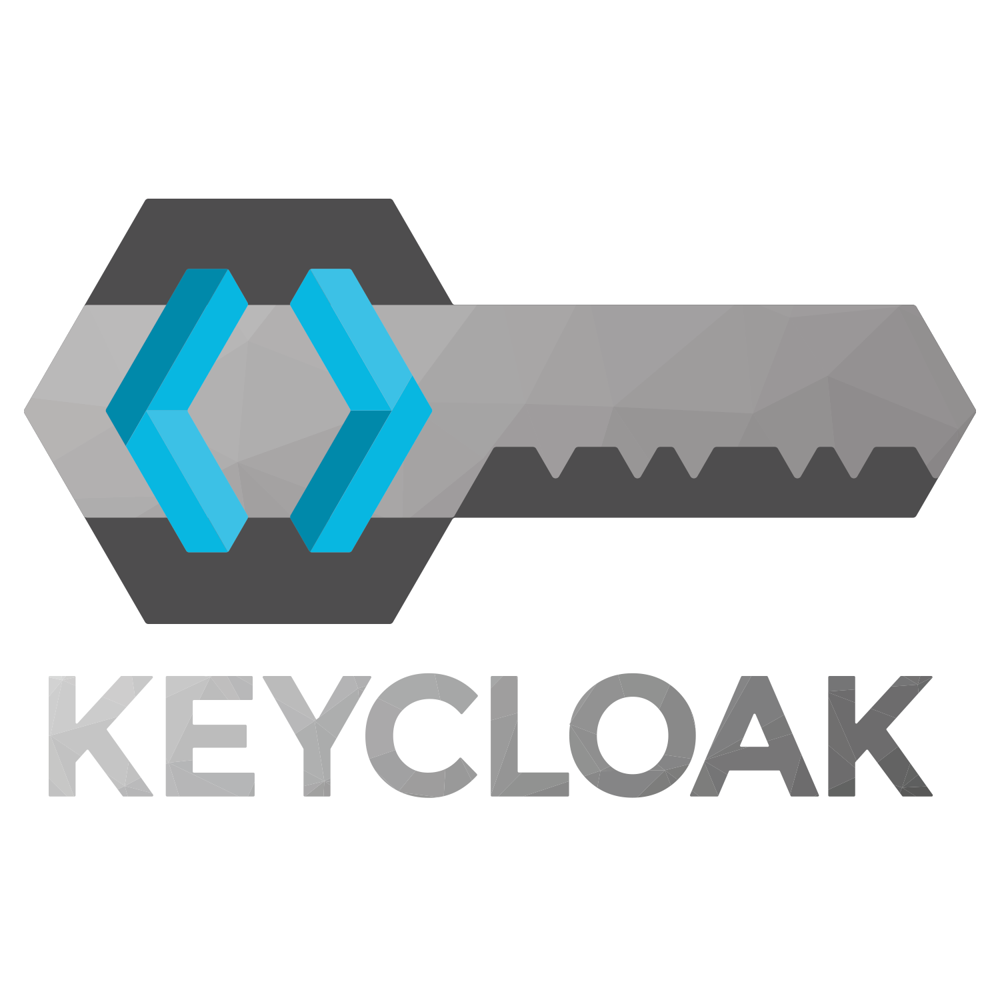

# Choix des technologies
### Backend
Working in **microservices** with the use of Java and the framework [Spring Boot](https://spring.io/projects/spring-boot). 

Spring Boot is a particular version of Spring that makes the process much easier because it handles most of the configuration details. Spring Boot was created to automate the startup of any Spring project, not just microservices. 
Our microservices developed with Spring follow the **MVC** (Model, View, Controller) structuring like many web applications. The infrastructure benefits from all the mechanisms present in Java (lambdas, jar creation, etc.), including the connection with databases (Repositories).

The choice of the dependency manager **Gradle**. The advantages of this tool are:
- possibility to script the build (the *build*) in files that can be automated ;
- possibility to change the default behavior of some tasks;
- a compact notation to describe dependencies;
- a production engine designed to produce multi-language projects which can be frequent in microservices environments.

**Keycloak** is an authentication management service with user and rights management. Conceptually, the intent of the tool is to *facilitate the protection of applications and services*.

We used this tool for several reasons including the fact that :

- it allowed us to focus on business functionality without having to worry about the security aspects of authentication
- we were able to modify the authentication methods and make them evolve without modifying the front-end application.

We used the **Apache Kafka** service which allowed us to use and store user locations. This tool allows us to store a large number of messages without having to manage them directly as in a database.
The advantages we found in Kafka :
- Low latency
- Fault tolerance
- Real time processing

### Frontend

We chose to use the **React** frontend framework. First of all, because all three of us have experience with this framework. The advantages that React offers are its component-oriented structure that allows to optimize code reuse, which would help us if we were to continue implementing the frontend site. We also chose it for its ease of integration of JS libraries which greatly helps in development (open source libraries available with [NPM](https://www.npmjs.com/)).

### Code Management

We used **Github** to host our source codes. This tool allows us to do versioning and to follow the evolution of the project thanks to the different branches (dev/master). Git allows us to code with several collaborators without causing major problems in the code (no conflicts etc.).
We also created an organization which allowed us to better organize the repositories and to easily find each microservice. The organization is available [here](https://github.com/CovIWAd).

See [structure](/geolocation).
